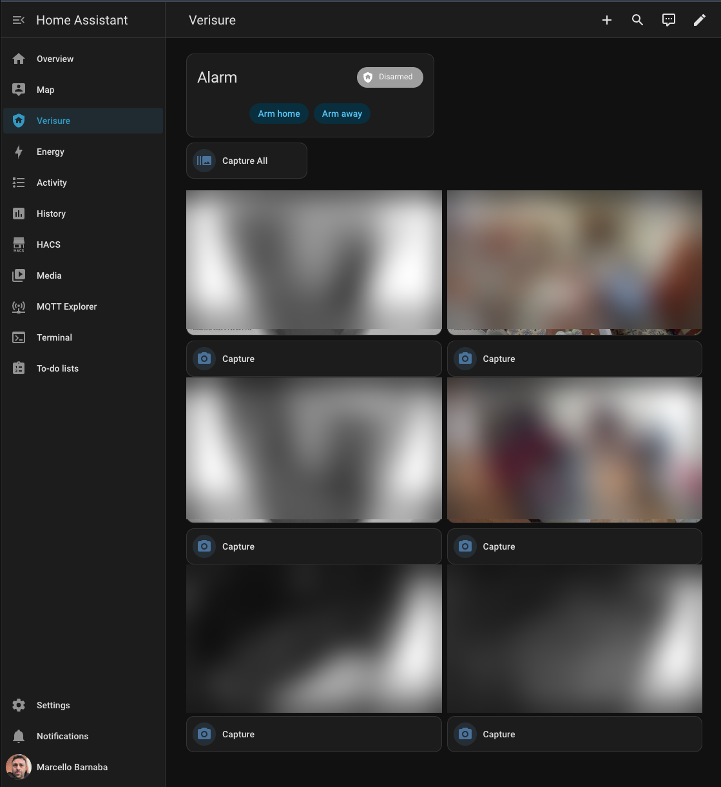
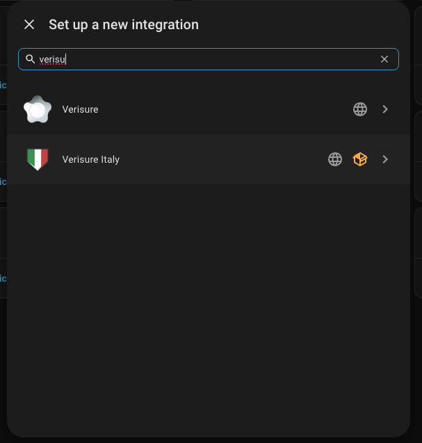
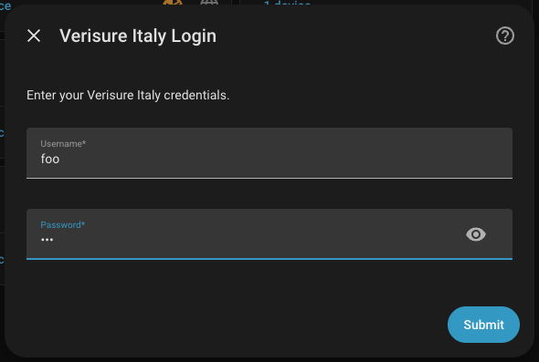
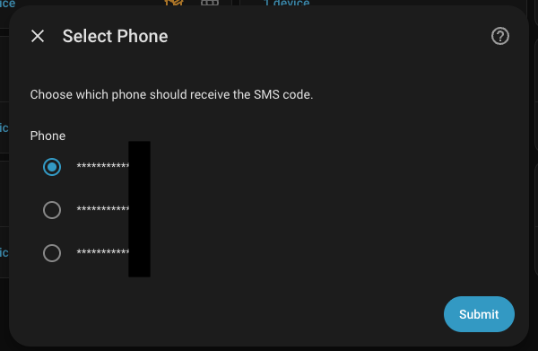
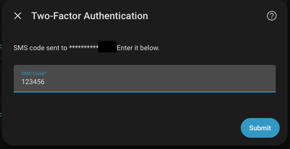
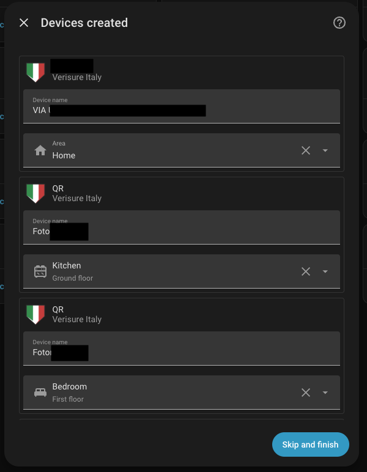
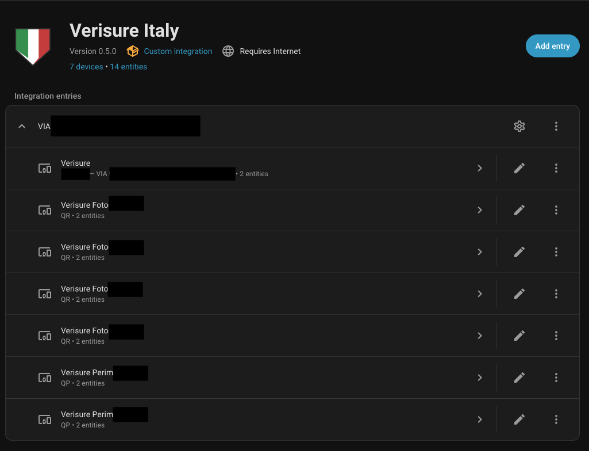

<p align="center">
  
</p>

# Verisure Italy for Home Assistant

Home Assistant custom component for **Verisure Italy** alarm systems.

Talks directly to `customers.verisure.it/owa-api/graphql`. Fully
replaces the Verisure mobile app for alarm control and camera monitoring.

> **Not affiliated with Verisure Group or Securitas Direct.**

<p align="center">
  
</p>

## Features

- **Alarm control** — arm home (partial+perimeter), arm away (total+perimeter), disarm
- **Force arm** — open zone detection with `verisure_italy_arming_exception` event and force-arm service
- **Cameras** — auto-discovered, on-demand capture with per-camera and capture-all buttons
- **Auto-managed dashboard** — Lovelace dashboard auto-populated with alarm panel, camera grid, and capture buttons
- **Passive polling** via xSStatus — no panel ping, no timeline spam
- **Configurable** — poll interval, operation timeout, and poll delay tunable from the UI
- **Config flow** with 2FA/OTP support

## Installation (HACS)

1. Open **HACS** in Home Assistant
2. Click **...** (top right) → **Custom repositories**
3. Add `https://github.com/vjt/ha-verisure-italy` as **Integration**
4. Search for "Verisure Italy" and install
5. Restart Home Assistant
6. Go to **Settings → Devices & Services → Add Integration → Verisure Italy**

The API client (`verisure-italy`) is installed automatically from
[PyPI](https://pypi.org/project/verisure-italy/).

## Setup

<details>
<summary>Step-by-step setup screenshots</summary>

### 1. Find the integration



### 2. Enter credentials



### 3. Select phone for 2FA



### 4. Enter SMS code



### 5. Devices are created



### 6. Integration page



</details>

## Dashboard

The integration auto-populates a `verisure-italy` Lovelace dashboard on every reload. To set it up:

1. Create the dashboard once (either method):
   - **UI**: Settings → Dashboards → Add Dashboard, set URL path to `verisure-italy`
   - **Script**: `source .env && python scripts/setup_dashboard.py`
2. Reload the integration — the dashboard is populated automatically

The dashboard includes the alarm panel with arm/disarm controls, a "Capture All" button, and a grid of all cameras with per-camera capture buttons.

## Alarm State Mapping

| Panel State | Proto | HA State | Action |
|---|---|---|---|
| Disarmed | `D` | Disarmed | disarm |
| Partial + Perimeter | `B` | Armed Home | arm_home |
| Total + Perimeter | `A` | Armed Away | arm_away |
| Perimeter only | `E` | Armed Custom Bypass | display only |
| Partial (no peri) | `P` | Armed Custom Bypass | display only |
| Total (no peri) | `T` | Armed Custom Bypass | display only |

## Entity IDs

| Entity | Example ID |
|---|---|
| Alarm panel | `alarm_control_panel.verisure_alarm` |
| Camera | `camera.verisure_fotocucina` |
| Capture button | `button.verisure_fotocucina_capture` |
| Capture all | `button.verisure_capture_all_cameras` |

## Development

```bash
python3 -m venv .venv
source .venv/bin/activate
pip install -e ".[dev]"

pytest tests/ -x -q
pyright verisure_italy/ custom_components/
ruff check verisure_italy/ tests/ custom_components/
```

## License

MIT. See [LICENSE](LICENSE).
