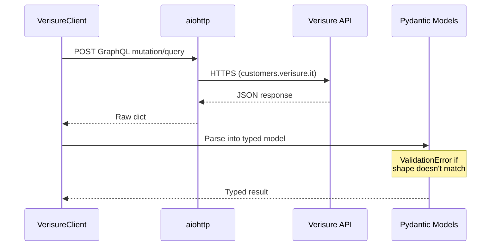
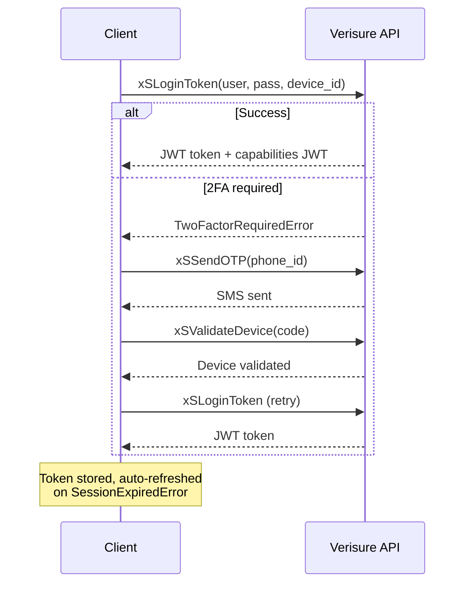
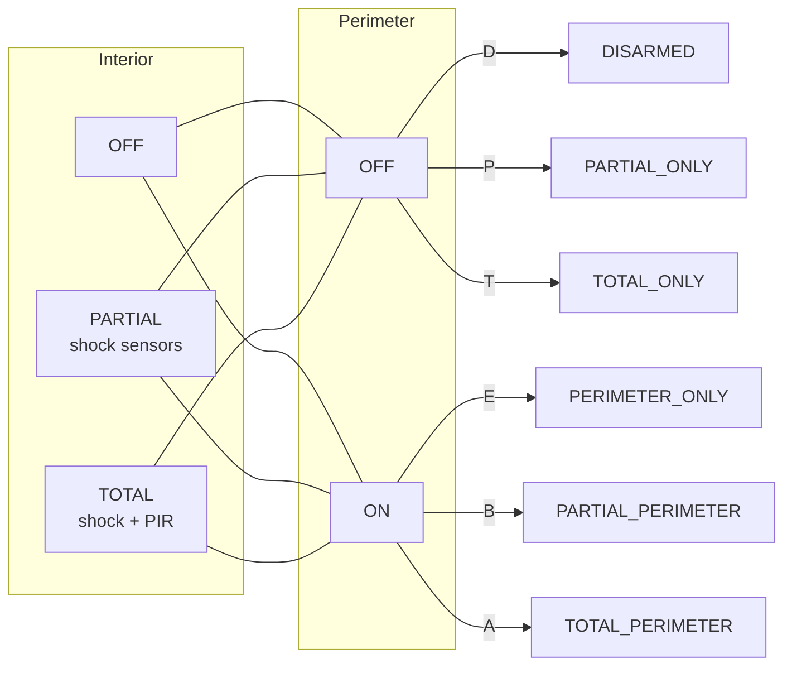
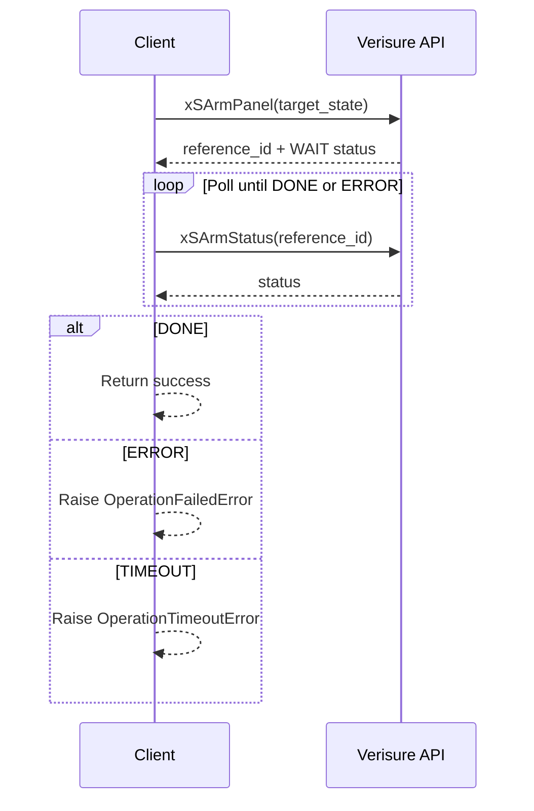
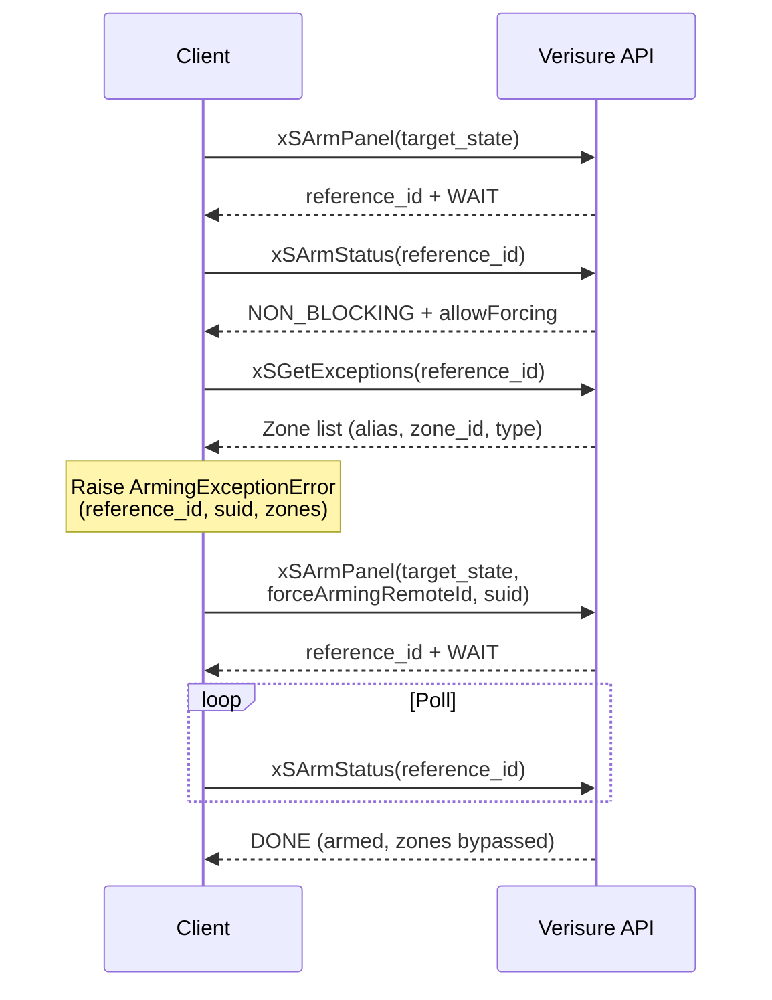
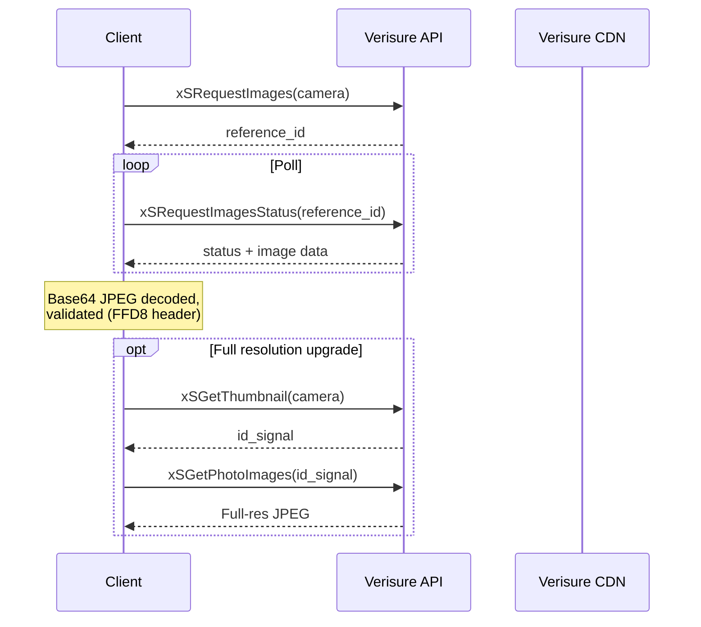

# Client Library Architecture

`verisure_italy` — async Python client for the Verisure Italy GraphQL API.

## Module Structure

```
verisure_italy/
├── __init__.py      # Public API surface (re-exports)
├── client.py        # VerisureClient — all API operations
├── models.py        # Pydantic models — the type boundary
├── exceptions.py    # One exception per failure mode
├── graphql.py       # GraphQL query/mutation strings
└── responses.py     # Response envelope parsing
```

## Data Flow



## Authentication



- JWT tokens are EdDSA-signed, per-installation capabilities
- Device registration is permanent — 2FA is only needed once per `device_id`
- Token refresh is `asyncio.Lock`-protected to prevent concurrent re-auth races

## Alarm State Model

Two axes, six protocol states. No defaults, no fallbacks.



| Proto | Interior | Perimeter | Real-world use |
|-------|----------|-----------|----------------|
| `D` | OFF | OFF | Home, everything off |
| `B` | PARTIAL | ON | Home, shock + perimeter |
| `A` | TOTAL | ON | Away, everything armed |
| `E` | OFF | ON | Perimeter only (rare) |
| `P` | PARTIAL | OFF | Partial only (rare) |
| `T` | TOTAL | OFF | Total only (rare) |

Unknown proto codes raise `UnexpectedStateError` — never silently default.

## Arm / Disarm Flow



## Force-Arm Flow

When arming is blocked by open zones (admin users only):



## Camera Capture



## Exception Hierarchy

```
VerisureError
├── AuthenticationError        # Bad credentials / locked account
├── TwoFactorRequiredError     # Device needs 2FA
├── SessionExpiredError        # JWT expired
├── APIResponseError           # GraphQL error (has http_status)
├── APIConnectionError         # Network failure
├── WAFBlockedError            # Incapsula WAF block
├── UnexpectedStateError       # Unknown proto code (SECURITY)
├── SameStateError             # Benign race — panel already in target state
├── StateNotObservedError      # Arm/disarm before first xSStatus
├── OperationTimeoutError      # Arm/disarm poll timeout
├── OperationFailedError       # Panel rejected operation
├── UnsupportedPanelError      # Panel not on SUPPORTED_PANELS allowlist
├── UnsupportedCommandError    # Panel's active services lack the command
├── ImageCaptureError          # Capture timeout / invalid data
└── ArmingExceptionError       # Open zones (has reference_id, suid, zones)
```

Every exception is specific. No generic catch-alls. Callers handle
what they can, let the rest propagate to generate human-visible
notifications.

## Security Properties

- **No silent failures.** Unknown proto codes crash with `UnexpectedStateError`, not a default state. If the alarm reports something we don't understand, a human gets notified.
- **Fail-secure.** `OperationTimeoutError` means "we don't know if it worked." The HA alarm entity responds by going UNKNOWN and requesting a forced refresh — it does NOT silently revert to the prior state. Direct client callers should do the same.
- **Parse at the boundary.** All API responses are parsed into Pydantic models immediately. `ValidationError` inside = bug in Verisure's API. No dicts or `Any` past the HTTP layer.
- **No credentials in memory longer than needed.** Password is used for login only, not stored after token acquisition.
- **Token refresh is atomic.** `asyncio.Lock` prevents concurrent refresh races that could leave the client in an inconsistent auth state.
- **Admin vs Restricted.** Force-arm (open zone bypass) only works with admin API users. Restricted users arm regardless of open zones — sensors will trip. This is a Verisure API design choice, not ours.
