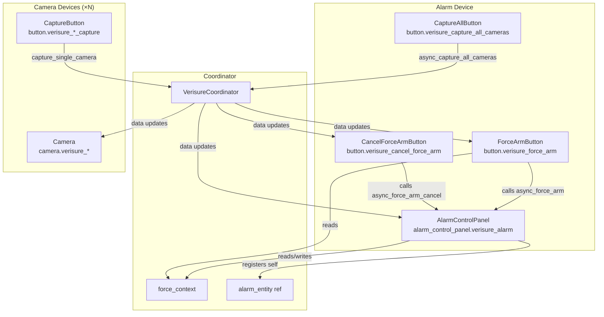
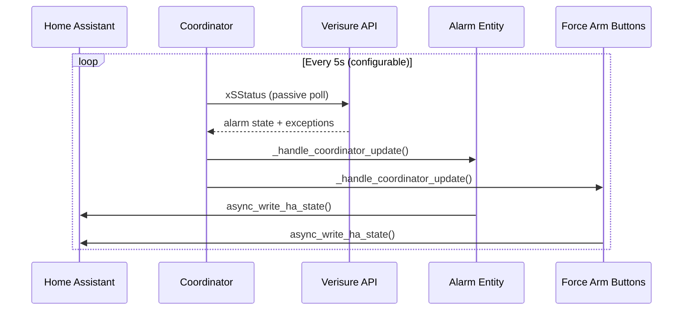
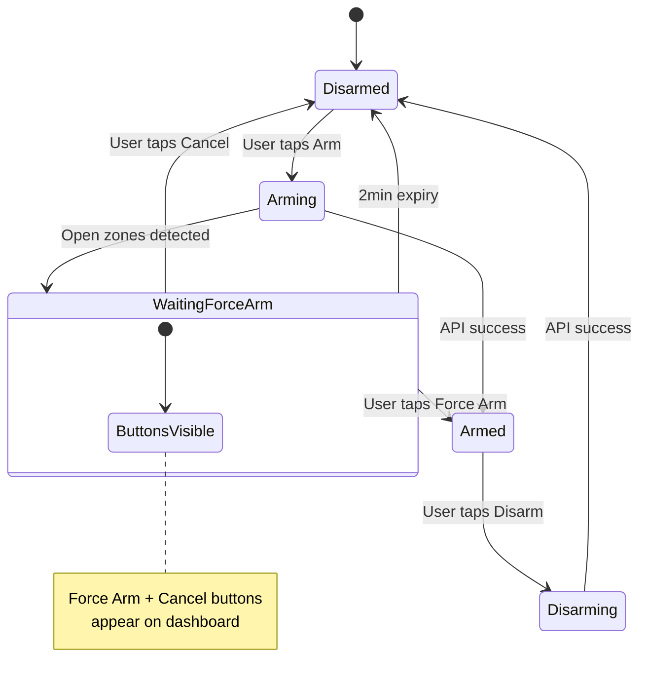
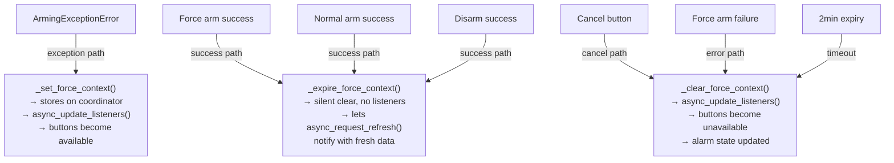
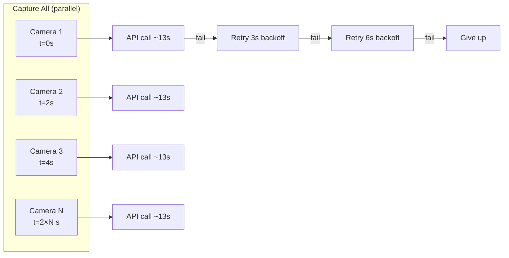
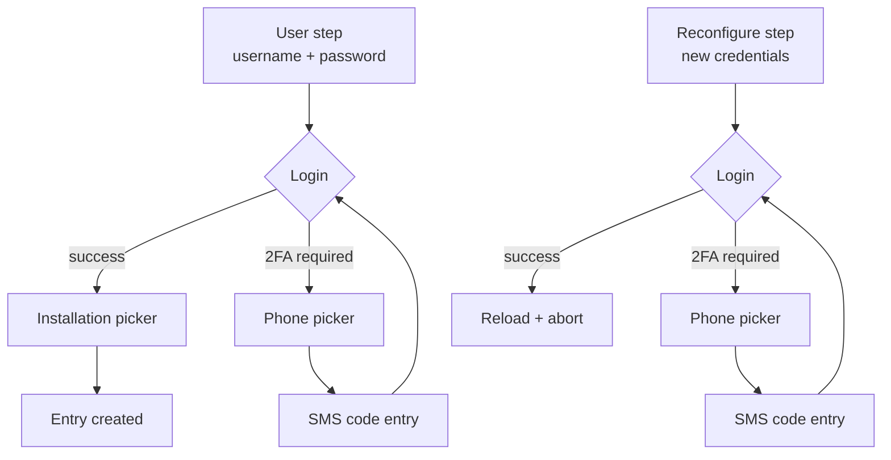

# HA Integration Architecture

`custom_components/verisure_italy` — Home Assistant custom component.

## Module Structure

```
custom_components/verisure_italy/
├── __init__.py           # Entry point, service registration
├── alarm_control_panel.py # Alarm entity + force-arm logic
├── button.py             # Capture + force-arm button entities
├── camera.py             # Camera entities (on-demand capture)
├── config_flow.py        # Config + options + reconfigure flows
├── coordinator.py        # DataUpdateCoordinator (polling + shared state)
├── dashboard.py          # Auto-managed Lovelace dashboard
├── const.py              # Domain, config keys, defaults
├── manifest.json         # HACS/HA metadata
├── strings.json          # UI strings
└── translations/en.json  # English translations
```

## Entity Relationship



## Polling and State Updates



## Arm with Force-Arm Flow



## State Suppression During Operations

Two layered guards prevent a background poll from racing a user-driven
mutation. The entity-layer lock stops the update-handler from writing
stale state; the coordinator-layer flag stops the poll itself from
even fetching fresh data (so no stale snapshot is ever committed to
`coordinator.data` mid-transition).

| Guard | Where | When active | Effect |
|-------|-------|-------------|--------|
| `_arm_lock` | alarm entity | Around every arm/disarm/force-arm call | `_handle_coordinator_update()` returns early — no state write |
| `suppress_updates()` | coordinator | Same scope as `_arm_lock` (paired via `async with self._arm_lock, self.coordinator.suppress_updates():`) | `_async_update_data()` short-circuits to cached snapshot — the client isn't called at all |

Without these, the coordinator's 5-second poll could read the panel's
real state (e.g. DISARMED) during an arm operation and write it,
causing a visible state flicker and triggering automations.

`force_context` (a separate piece of state on the coordinator) is
not a guard — it's a data carrier for the 120s window between an
`ArmingExceptionError` and the user's decision (force-arm or cancel).
Its lifecycle is described below.

## Force Context Lifecycle



**Why two clear methods?**

- `_clear_force_context()` calls `async_update_listeners()` — buttons
  disappear immediately. Used in cancel/error paths where coordinator
  data is the correct state to display.

- `_expire_force_context()` clears silently. Used in success paths
  where the coordinator data is stale (hasn't polled yet). The
  following `async_request_refresh()` polls fresh data and notifies
  all entities. Without this split, the alarm would briefly show
  DISARMED (stale) before showing ARMED (fresh).

## Camera Capture



Cameras launch 2 seconds apart via `asyncio.gather` with staggered
`asyncio.sleep`. Each camera retries up to 2 times with exponential
backoff (3s, 6s). A `_capture_lock` prevents concurrent capture
rounds.

## Dashboard

The integration self-registers a Lovelace dashboard panel in the
sidebar using `frontend.async_register_built_in_panel`. The dashboard
config is rebuilt from discovered entities on every integration load.

The dashboard is removed when the integration is unloaded.

**Note:** This uses `LovelaceStorage` internals. If a HA update
breaks it, the integration continues to work — only the auto-generated
dashboard is affected.

## Config Flow



Options flow allows changing poll interval, timeout, and delay
without restart — applied live via `_async_options_updated`.

## Security Model

### This is security software

The alarm system protects a physical space. One wrong behavior =
disarmed alarm = intrusion. Every design decision prioritizes
correctness over convenience.

### Fail-secure design

| Scenario | Behavior |
|----------|----------|
| Unknown alarm state | `UnexpectedStateError` + notification. Never defaults to DISARMED. |
| Arm/disarm timeout | `OperationTimeoutError`. Entity state goes UNKNOWN and a forced refresh resolves it from the real panel — we do NOT guess the prior state. (`OperationFailedError`, where the panel explicitly rejected the command, is unambiguous and does revert to prior.) |
| Poll failure | `UpdateFailed`. Last known state preserved. |
| Force context expired | Reverts to coordinator data. Buttons disappear. |
| Panel armed via another path | Stale `force_context` auto-evicts on the next coordinator update (any non-DISARMED observation clears the pending token so a stale `reference_id` can't fire). |
| Unexpected exception in arm flow | `_arm_lock` + `suppress_updates()` released by the `async with` block. State recovers on the post-release `async_request_refresh()`. |

### Credential handling

- Credentials stored in HA's encrypted config entry storage
- Password used only for login, not retained after token acquisition
- Reconfigure flow updates credentials without exposing them in logs
- 2FA device registration is permanent per `device_id`

### API user roles

| Role | Arm behavior | Force arm | Risk |
|------|-------------|-----------|------|
| RESTRICTED | Arms regardless of open zones | N/A (no exceptions raised) | Sensors will trip |
| ADMIN | Raises `ArmingExceptionError` on open zones | Supported with `forceArmingRemoteId` + `suid` | User chooses to bypass |

The integration requires an ADMIN user for correct force-arm behavior.

### Attack surface

- **Network:** All communication over HTTPS to `customers.verisure.it`. No local panel access.
- **Authentication:** JWT tokens (EdDSA). Token refresh is lock-protected.
- **HA exposure:** Services (`force_arm`, `force_arm_cancel`, `capture_cameras`) require HA authentication. No unauthenticated endpoints.
- **Dashboard:** Read-only auto-generated panel. Cannot be edited from the UI.
